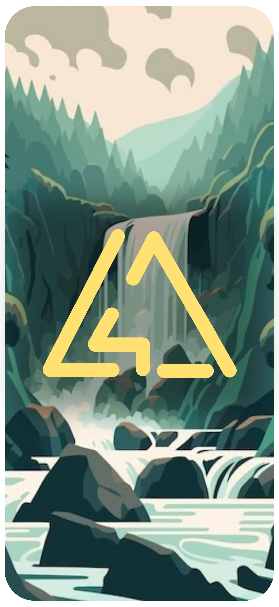

  
  

    <samp>
     
      
Hi. I'm lighttigerXIV. I am 23y old and 🇵🇹 Portuguese

I like to 🖥️ code, 🎶 listen to music and 🇯🇵 watch anime. (Basically a nerd)

My favourite languages are 🦀 Rust and 🤖 Kotlin.

My preferred platform to code is Android which gave me the curiosity to dive into the world of programming.
  
This are some of my best projects:
      
[SimpleMP](https://github.com/lighttigerXIV/SimpleMP-Compose) - A simple music player with Material You in mind.

[Whiskers Launcher](https://github.com/lighttigerXIV/whiskers-launcher) - A keyboard app launcher for Linux and Windows and that supports extensions. 

[Catppuccinifier](https://github.com/lighttigerXIV/catppuccinifier) - A gui/cli app to apply catppuccin luts to images.

[Whiskers Color Scheme](https://github.com/Whiskers-Color-Scheme) - A theme based on my cats

[Whiskers Apps](https://github.com/Whiskers-Apps) - An organization with apps integrated with my color scheme
    </samp>
  

